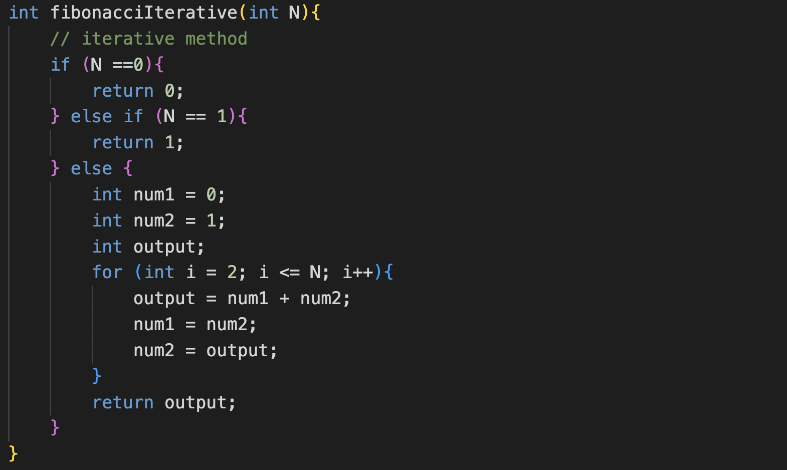
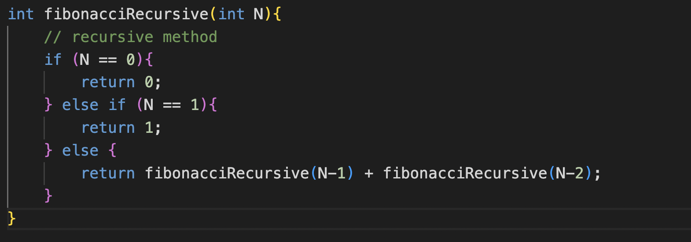
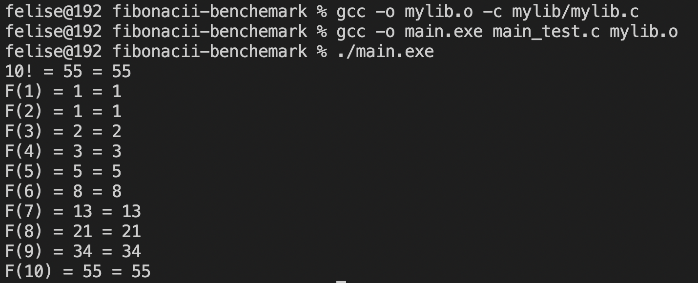
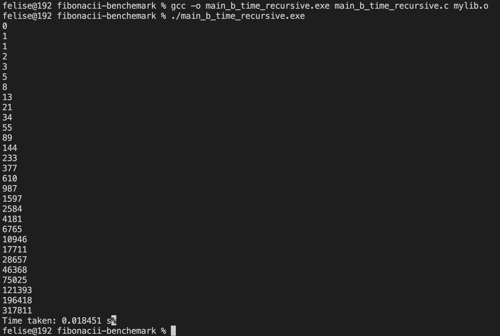

## Definition
Fibonacci Sequence is a series of numbers in which each number is the sum of the two preceding numbers. The simplest is the series 1, 1, 2, 3, 5, 8, etc. A fibonacci sequence can be calculated in two ways, iterative and recursive.

## Iterative Method
 

## Recursive Method

## Output

## Time complexity
### Iterative Method

### Recursive Method

#### Recursive Method is much slower than Iterative Method due to the overhead of function calls and control shift from one function to another.

## Space complexity

#### As can be seen, recursive takes up more space than iterative. My mac cannot display the memory used by each file while running so i do it manually. The first pic is the size when i run iterative and the second one is when i run recursive.

